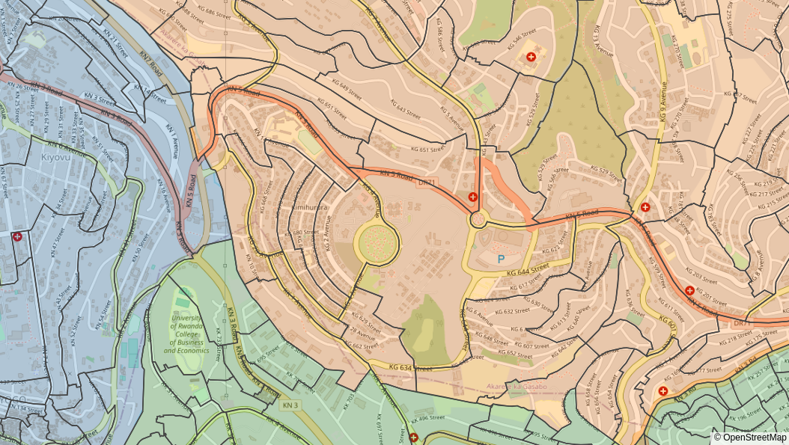
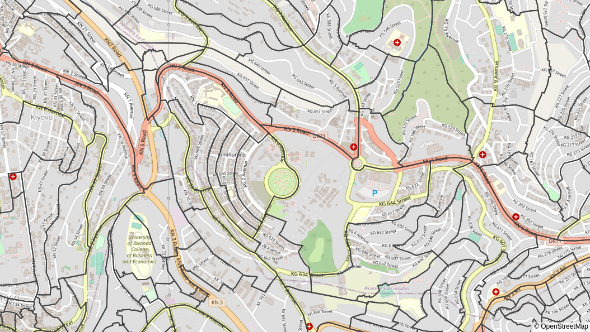

# Umudugudu map of Kigali

This code is used to build an interactive map of Villages/Umudugudus of Kigali.
Follow this link for the interactive map:
[https://felipeam86.github.io/umudugudu/](https://felipeam86.github.io/umudugudu/)


## Reproducing the map

The code is written in Python and uses the shapefiles published by the
[world bank data catalog](https://datacatalog.worldbank.org/dataset/rwanda-admin-boundaries-and-villages/resource/541db017-5a04-4f3d-a387-20a169553a50) 

### Prepare your Python environment

Install the dependencies from the requirements file with your favorite Python environment:

```bash
pip install -r requirements.txt
```

Alternatively, if you are familiar with [poetry](https://python-poetry.org/), you can prepare your environment with:

```bash
poetry install
```

### Preprocess the shapefiles

Run the following command in order to prepare the shapefiles before creating the map:

```bash
python shapefiles/process_data.py 
```

If you are using Poetry, prepend the command with `poetry run`:

```bash
poetry run python shapefiles/process_data.py 
```


### Create the map

The script `create_map.py` creates the map and has the following arguments:

- `--opacity `: Control the opacity of the polygons to increase or decrease visibility of the map bellow the Umudugudu boundaries
- `--line-width `: Controls the thickness of the Umudugudu boundaries
- `--transparent / --no-transparent `: If `--transparent`, leave the boundaries only and use a transparent fill

As an example, this is the equivalent of the default behaviour:

```bash
python create_map.py --opacity 0.25 --line-width 1.5
```

And it will produce an output with the following characteristics:




Or, if you want a transparent background:

```bash
python create_map.py --transparent --line-width 2
```
Which will produce an output with the following characteristics:



Both commands will create an `index.html` file in the `html` folder.